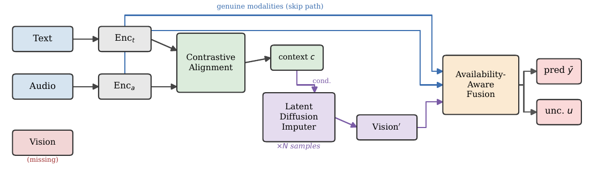

# DiffCMI: Diffusion-Based Uncertainty Estimation for Robust Multimodal Sentiment Analysis under Missing Modalities

[](https://www.python.org/downloads/)
[](https://pytorch.org/)
[](LICENSE)

Code for **DiffCMI**, a framework for robust multimodal sentiment analysis under missing modalities.

> **Note:** The accompanying paper is currently under review. This repository releases the
> code and experimental results only. Citation details will be added once the paper is published.

## Overview

Most work on missing-modality multimodal sentiment analysis (MSA) treats the problem as one of *recovery*: a missing modality is reconstructed and then fed to a classifier as if it were genuine. DiffCMI takes a different view: what matters in deployment is not only how accurately a modality is recovered, but **whether a prediction made from a recovered modality can be trusted at all**.

DiffCMI imputes missing modalities with a conditional latent diffusion process. Because diffusion is generative, running it several times from different noise seeds produces a *distribution* of plausible completions, and the spread of the resulting predictions is a **training-free estimate of uncertainty**. This is something deterministic imputers structurally cannot provide. The estimate supports **selective prediction**: by deferring the least confident inputs, accuracy on the rest rises by up to 10.2 points.

<p align="center">
  
</p>

## Key Features

- **Contrastive Cross-Modal Alignment (CCMA)** — projects available modalities into a shared latent space so the diffusion condition is semantically coherent.
- **Conditional Latent Diffusion Imputer (CLDI)** — completes missing modalities in latent space with a short, differentiable sampler; the same routine is used at train and test time, so there is no train/test distribution gap.
- **Availability-Aware Fusion** — a transformer that knows which features are genuine and which are imputed, and treats them accordingly.
- **Sampling-Based Uncertainty** — repeated imputation yields a predictive mean and standard deviation; the std is used as an uncertainty score for selective prediction.

## Installation

```bash
git clone https://github.com/<your-username>/DiffCMI.git
cd DiffCMI
pip install -r requirements.txt
```

Tested with Python 3.9, PyTorch 1.12, on a single NVIDIA RTX 4080 SUPER GPU.

## Data Preparation

We use the standard pre-extracted, word-aligned features from the [CMU-MultimodalSDK](https://github.com/A2Zadeh/CMU-MultimodalSDK) and the [MMSA toolkit](https://github.com/thuiar/MMSA). See [docs/DATA.md](docs/DATA.md) for details.

| Dataset | File | Dims (T/A/V) | Label range |
|---|---|---|---|
| CMU-MOSI | `MOSI/aligned_50.pkl` | 768 / 5 / 20 | [-3, 3] |
| CMU-MOSEI | `MOSEI/aligned_50.pkl` | 768 / 74 / 35 | [-3, 3] |
| CH-SIMS v2 | `CHSIMS/unaligned_39.pkl` | 768 / 25 / 177 | [-1, 1] |

Place the `.pkl` files under a data root directory:

```
data/
├── MOSI/aligned_50.pkl
├── MOSEI/aligned_50.pkl
└── CHSIMS/unaligned_39.pkl
```

## Usage

### Single experiment

```bash
python diffcmi_experiment.py \
    --dataset mosi \
    --data_path ./data/MOSI/aligned_50.pkl \
    --epochs 50 \
    --with_baselines \
    --eval_uncertainty
```

### Full experiment matrix

```bash
bash scripts/run_all.sh
```

This runs the three-dataset main comparison, the MOSEI missing-rate sweep, and the structured-missing study, all under the fixed-mask evaluation protocol, writing results to `outputs/results.json`.

### Key arguments

| Argument | Description | Default |
|---|---|---|
| `--dataset` | `mosi` / `mosei` / `chsims` | `mosi` |
| `--data_path` | path to a single dataset `.pkl` | — |
| `--data_root` | root dir for `--run_all` auto-discovery | — |
| `--missing_rate` | per-modality drop probability | `0.5` |
| `--missing_type` | `random` / `text` / `audio` / `vision` | `random` |
| `--with_baselines` | also run zero / mean / MMIN baselines | off |
| `--eval_uncertainty` | run the uncertainty + selective-prediction study | off |
| `--unc_samples` | number of diffusion samples for uncertainty | `10` |
| `--run_all` | run the full experiment matrix | off |

## Results

Performance under 50% random missing (binary accuracy, %):

| Dataset | Zero-Imp | Mean-Imp | MMIN | **DiffCMI** |
|---|---|---|---|---|
| CMU-MOSEI | 72.6 | **75.2** | 73.3 | 73.6 |
| CMU-MOSI | 67.3 | **70.3** | 67.3 | 66.5 |
| CH-SIMS v2 | 71.2 | 70.8 | **72.4** | 72.0 |

DiffCMI is competitive on accuracy but **does not claim accuracy supremacy**. Its advantage is reliability. Selective prediction (deferring the most uncertain inputs) lifts retained-set accuracy:

| Dataset | 100% coverage | 50% coverage | Gain |
|---|---|---|---|
| CMU-MOSI | 66.5 | **76.7** | +10.2 |
| CMU-MOSEI | 73.5 | **79.1** | +5.6 |
| CH-SIMS v2 | 71.6 | **74.3** | +2.7 |

The uncertainty estimate correlates positively with prediction error (Spearman rho = 0.236 / 0.114 / 0.172 on MOSI / MOSEI / SIMS). The full results are in `results.json`.

## Project Structure

```
DiffCMI/
├── diffcmi_experiment.py     # main implementation (model, training, evaluation)
├── make_figures.py           # reproduce result figures from results.json
├── make_overview.py          # reproduce the architecture diagram
├── results.json              # all experimental results
├── requirements.txt
├── scripts/                  # run / monitor / stop helper scripts
├── figures/                  # generated figures
└── docs/                     # data and model documentation
```

## Reproducing the Figures

```bash
python make_figures.py     # main result figures
python make_overview.py    # architecture diagram
```

## License

This project is released under the MIT License. See [LICENSE](LICENSE) for details.
